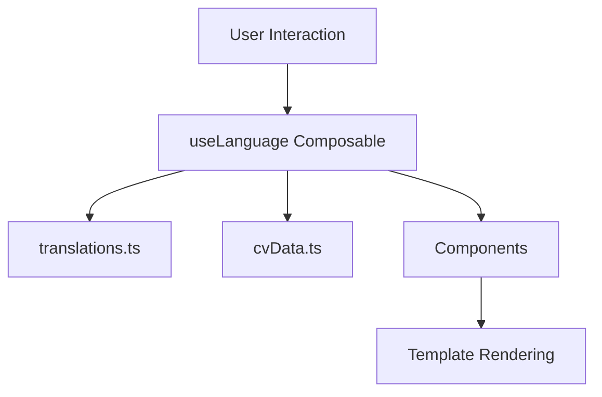

# 📋 Documentación del Portfolio - Irvin Benitez

## 🎯 Descripción General

Este portfolio es una aplicación web moderna desarrollada con Vue.js 3, TypeScript y Tailwind CSS que presenta el perfil profesional, experiencia, proyectos y habilidades de Irvin Benitez como desarrollador Full-Stack.

## 🛠️ Tecnologías Utilizadas

### Frontend
- **Vue.js 3** - Framework principal con Composition API
- **TypeScript** - Tipado estático para mayor robustez
- **Tailwind CSS** - Framework de utilidades CSS
- **Lucide Vue Next** - Librería de iconos
- **Vite** - Herramienta de construcción y desarrollo

### Características Principales
- ✅ Diseño responsivo (mobile-first)
- ✅ Modo oscuro/claro
- ✅ Internacionalización (Español/Inglés)
- ✅ Animaciones suaves con CSS
- ✅ Carrusel de proyectos interactivo
- ✅ Navegación con scroll spy
- ✅ Descarga de CV en PDF

## 📁 Estructura del Proyecto

```
src/
├── components/           # Componentes Vue reutilizables
│   ├── AboutSection.vue     # Sección "Acerca de" (2 versiones disponibles)
│   ├── AboutSectionV1.vue   # Versión con cards de estadísticas
│   ├── AboutSectionV2.vue   # Versión minimalista con timeline
│   ├── AppFooter.vue        # Pie de página
│   ├── AppHeader.vue        # Navegación principal
│   ├── ContactSection.vue   # Formulario de contacto
│   ├── EducationSection.vue # Educación académica
│   ├── ExperienceSection.vue# Experiencia laboral
│   ├── HeroSection.vue      # Sección principal/hero
│   ├── ProjectsSection.vue  # Carrusel de proyectos
│   └── SkillsSection.vue    # Habilidades técnicas e interpersonales
├── composables/         # Lógica reutilizable
│   ├── useGSAP.ts          # Animaciones con GSAP
│   └── useLanguage.ts      # Gestión de idiomas
├── data/                # Datos estáticos
│   ├── cvData.ts           # Información del CV (ES/EN)
│   └── translations.ts     # Traducciones
├── types/               # Definiciones de TypeScript
│   └── index.ts            # Tipos e interfaces
├── assets/              # Recursos estáticos
│   └── files/              # Archivos PDF del CV
└── style.css            # Estilos globales
```

## 🎨 Componentes Principales

### 1. AppHeader.vue
**Función**: Navegación principal con scroll spy
**Características**:
- Logo y nombre
- Menú de navegación responsive
- Cambio de idioma (ES/EN)
- Toggle modo oscuro/claro
- Menú hamburguesa para móviles
- Indicador visual de sección activa

### 2. HeroSection.vue
**Función**: Sección principal de presentación
**Características**:
- Información personal
- Descripción profesional multiidioma
- Botones CTA (Contacto/Descargar CV)
- Información de contacto
- Avatar placeholder
- Animaciones de fondo

### 3. AboutSection.vue (2 Versiones)

#### Versión 1 (AboutSectionV1.vue)
- Cards de estadísticas con gradientes
- Diseño moderno con efectos hover
- Barras de progreso animadas
- Iconos lucide para cada métrica

#### Versión 2 (AboutSectionV2.vue)
- Diseño minimalista
- Timeline horizontal/vertical
- Cita inspiracional
- Elementos flotantes de fondo

### 4. SkillsSection.vue
**Función**: Muestra habilidades técnicas e interpersonales
**Características**:
- Grid responsive de categorías técnicas
- Tags de tecnologías con limitación visual
- Sección interpersonales con iconos únicos
- Barras de progreso animadas
- Efectos hover avanzados

### 5. ProjectsSection.vue
**Función**: Carrusel interactivo de proyectos
**Características**:
- Un proyecto por vista (mejorado)
- Navegación con flechas
- Indicadores de posición (dots)
- Auto-play con pausa manual
- Cards de proyecto con gradientes
- Enlaces a proyecto y GitHub
- Tecnologías utilizadas como tags

### 6. ExperienceSection.vue
**Función**: Timeline de experiencia laboral
**Características**:
- Timeline vertical responsive
- Cards de experiencia con hover effects
- Información de duración y empresa
- Descripciones detalladas

### 7. ContactSection.vue
**Función**: Información de contacto
**Características**:
- Links de contacto directo
- Información personal
- Botones con iconos
- Diseño limpio y accesible

## 🌐 Internacionalización

### Estructura de Idiomas
```typescript
// translations.ts
export const translations = {
  es: { /* Traducciones en español */ },
  en: { /* Traducciones en inglés */ }
}
```

### Datos por Idioma
```typescript
// cvData.ts
export const cvDataES: CVData = { /* Datos en español */ }
export const cvDataEN: CVData = { /* Datos en inglés */ }
```

### Uso en Componentes
```vue
<script setup>
import { useLanguage } from '../composables/useLanguage'
const { t, cvData, currentLanguage, toggleLanguage } = useLanguage()
</script>

<template>
  <h1>{{ t.title }}</h1>
  <p>{{ cvData.description }}</p>
</template>
```

## 🎨 Sistema de Diseño

### Colores Principales
- **Azul**: `#2563eb` (blue-600)
- **Púrpura**: `#7c3aed` (purple-600)
- **Verde**: `#059669` (green-600)
- **Gris**: `#374151` (gray-700)

### Gradientes
- **Primario**: `from-blue-600 to-purple-600`
- **Secundario**: `from-purple-600 to-pink-600`
- **Acento**: `from-green-600 to-blue-600`

### Espaciado
- **Secciones**: `py-20` (80px vertical)
- **Contenedores**: `px-6` (24px horizontal)
- **Cards**: `p-6` o `p-8` (24px/32px)

### Efectos de Hover
```css
transform hover:-translate-y-2
hover:shadow-xl
transition-all duration-300
```

## 📱 Responsive Design

### Breakpoints
- **Mobile**: `< 768px`
- **Tablet**: `768px - 1024px`
- **Desktop**: `> 1024px`

### Grid Systems
```css
/* Mobile First */
grid-cols-1           /* 1 columna */
md:grid-cols-2        /* 2 columnas en tablet */
lg:grid-cols-3        /* 3 columnas en desktop */
```

## ⚡ Optimizaciones

### Performance
- Lazy loading de componentes
- Optimización de imágenes
- CSS purging con Tailwind
- Tree shaking automático con Vite

### Accesibilidad
- Navegación por teclado
- ARIA labels
- Contraste de colores adecuado
- Focus indicators visibles

### SEO
- Meta tags apropiados
- Estructura semántica HTML5
- URLs limpias
- Sitemap.xml (pendiente)

## 🚀 Scripts Disponibles

```bash
# Desarrollo
npm run dev

# Construcción
npm run build

# Preview de construcción
npm run preview

# Linting
npm run lint
```

## 📝 Configuración

### Archivos de Configuración
- `vite.config.ts` - Configuración de Vite
- `tailwind.config.cjs` - Configuración de Tailwind
- `tsconfig.json` - Configuración de TypeScript
- `postcss.config.cjs` - Configuración de PostCSS

## 🔄 Flujo de Datos



## 🎯 Próximas Mejoras

### Funcionalidades Pendientes
- [ ] Formulario de contacto funcional
- [ ] Blog/artículos
- [ ] Testimonios
- [ ] Certificaciones
- [ ] Modo de impresión
- [ ] PWA (Progressive Web App)
- [ ] Analytics integration
- [ ] Sitemap dinámico

### Optimizaciones Técnicas
- [ ] Implementar GSAP para animaciones avanzadas
- [ ] Lazy loading de imágenes
- [ ] Service Worker para cache
- [ ] Optimización de Core Web Vitals
- [ ] Tests unitarios con Vitest
- [ ] E2E tests con Cypress

## 📞 Contacto del Desarrollador

**Irvin Benítez**
- 📧 Email: Irvin.benitezs.26@gmail.com
- 📱 Teléfono: +507 6361-5832
- 🌐 LinkedIn: [linkedin.com/in/irvin-benitez](https://www.linkedin.com/in/irvin-benitez-11313231b/)
- 💼 Portfolio: [irvin-benitez.software](https://irvin-benitez.software/)

---

*Documentación actualizada: Octubre 2025*